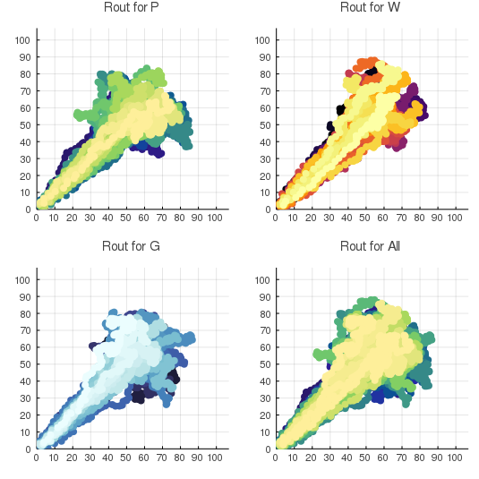
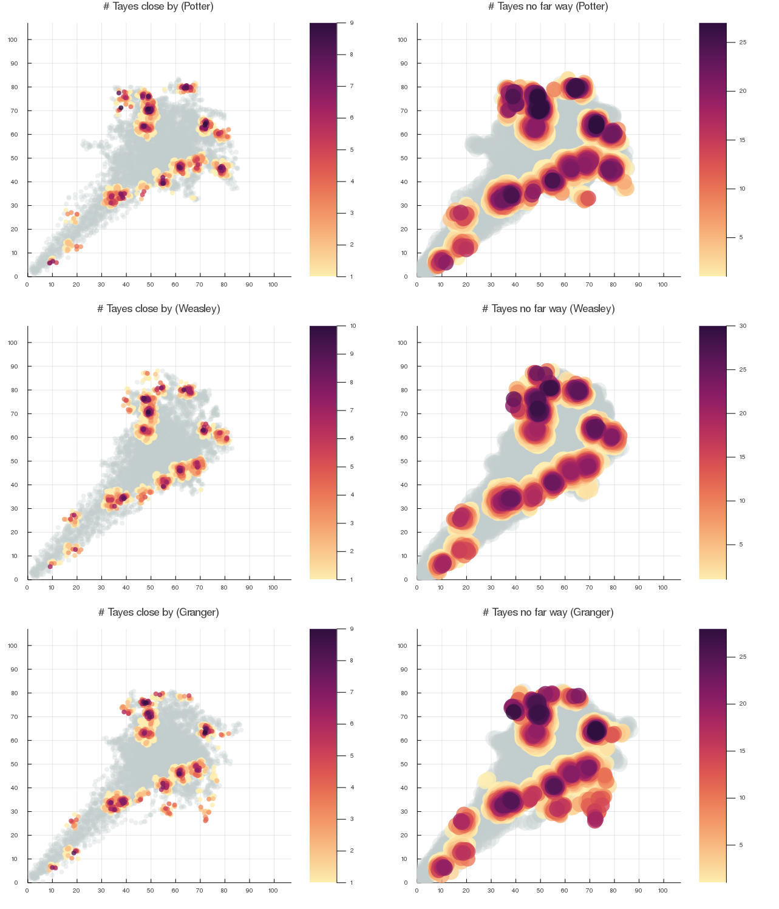
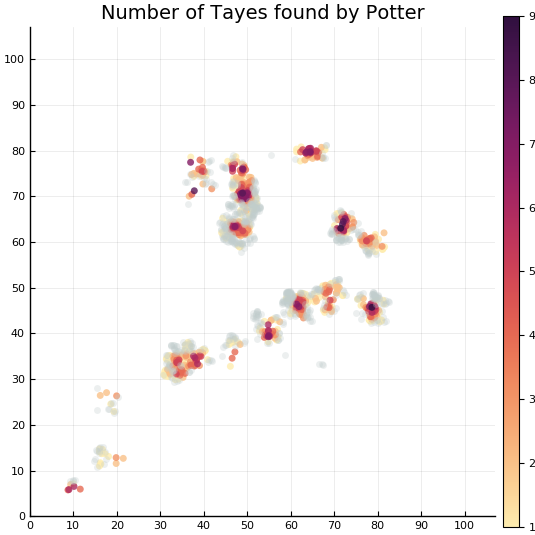

# Ve414 

> Jing Liu

Project Due: Week 12/13

## 0. Some Pics

### 1. All routes

### 2. Personal trips

### 3. All trips

## 1. Instructions

### 1.1 Format

Each of you need to be in one and only one 3-member team for the project. The project will be graded according to the following three aspects:

1. Poster Presentation of your work

2. Oral Presentation of your work

3. Accuracy and efficiency of your algorithm

Each of those three aspects has an equal weight. Each member of the same team will receive the same project mark.

### 1.2 Due

The poster is due on Tuesday week 12, Nov 28th. The oral presentation and testing of your algorithm are due in week 13. The exact time for the presentation and testing will be released in week 12.

### 1.3 Expectation

Your method should have its roots in Bayesian analysis. However, your method need not be something that we have covered in class. It is expected that you read academic articles as well as textbooks. Your poster should summarise important aspects of your research on the problem effectively. Your poster should be easy to read and understand, and is visually appealing. We expect your presentation to be 15 minutes long, followed by a 3-5 minute question and answer session. We do not expect you to present all aspects of what you have done during the presentation. However, we expect you as a group to know very well what you have done so that you can explain to us if we choose to ask a question on a different aspect of your solution. During your presentation, we expect to see your algorithm in action. You will run your algorithm on our machine with 4G of memory. We expect your algorithm to complete within 20 minutes. Your algorithm should be entirely written in Julia. You may not use packages other than the followings:

CSV, LinearAlgebra, Distributions, Random

We expect at least 1 hour of work from each student per week to be put into the project.

## 2. Background Story

Although data science only became popular in the past 10 years in the human world, it has been round for hundreds of years at wizarding world of Harry Potter. Being someone always ahead in terms of learning, Hermione Granger started her master project in year one. In the Forbidden Forrest of Hogwarts, there is a kind of magic tree, known as Jiuling, not only it is always invisible but it has no physical form, thus cannot be seen or detected even by someone as power and as wise as Albus Dumbledore. However, the fruit of Jiuling trees, known as Tayes, can be seen without any problem once it is on the ground. For her master project, Hermione intends to wield data science as well as her magic wand to determine the number of Jiuling trees in the Forbidden Forest, thus prove she is almighty. 

Every time students have a class in the Forbidden Forrest, they have to walk from the entry on Hogwarts’ side, but Hagrid uses an ancient and secret spell to Apparate all students back to the Hogwarts Castle once the class is over. In order to complete her master project, Hermione has secretly cast a spell on Harry Potter, Ron Weasley and herself. The spell activates every time when they are in the Forbidden Forrest. It records the position of the person under the spell at an 1-minute interval, and records the number of Tayes close by (less 1 meter away) on the ground and the number of Tayes no far way (less 3 meters away) on the ground from the person. It is known that the spell is perfect in terms of the position of the person, and the number of Tayes close by. However, the spell is known to be inaccurate when comes to recording the number of Tayes no far way. But the precise nature of this inaccuracy is not known. Over the years, the spell has collected all those information for various trips that each person attended Hagrid’s class. Hermione knows the Forbidden Forrest is 107 meters wide and 107 meters long. She also researched the origin of Jiuling. It turns out they were created and planted by Godric Gryffindor in the beginning of Hogwarts as a symbol of eternal knowledge and learning. You never see the true form of it, because it has none, but you see the fruit of learning and having knowledge. Jiuling never dies, and cannot move around or be stolen. Since Godric Gryffindor never told the secret about how to create and plant Jiuling. The number of Jiuling has never changed over the history of Hogwarts.

## 3. Tasks

Tasks

The followings are the tasks for you as Hermione to do:

### Task 1

Since the spell that Hermione used is not a common spell, the first thing to do is to understand what have been recorded by the spell. Graphs of the locations and information that is available are very much useful. You should use at least one graph in your poster, and one graph in your presentation.

### Task 2

The main task is to estimate the number of Jiuling in the Forbidden Forrest, then the location of Jiuling. The estimated number of Jiuling and their locations will largely affected by your assumptions. You first need to make sure you know and understand all the assumptions your model is based on. As long as your assumptions are consistent with the data, whether those assumptions are correct “in practice” is a secondary objective.

### Task 3 

Propose what we will need in order to address the main task if Jiuling can actually move!