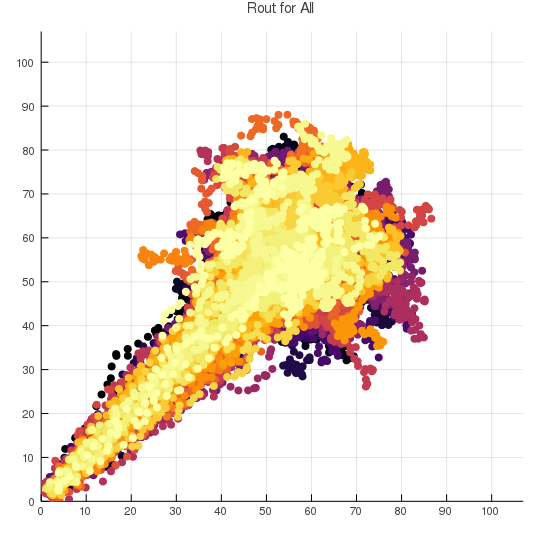
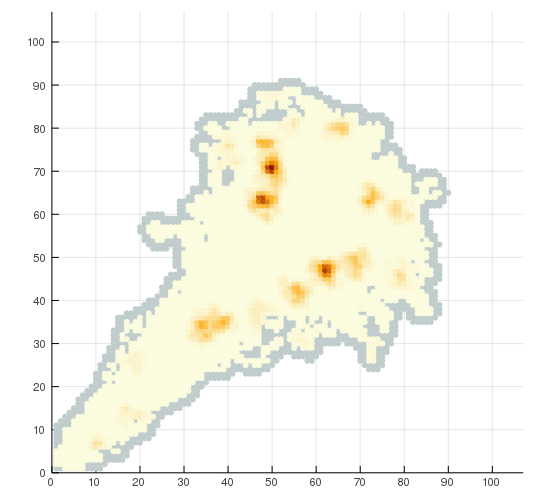
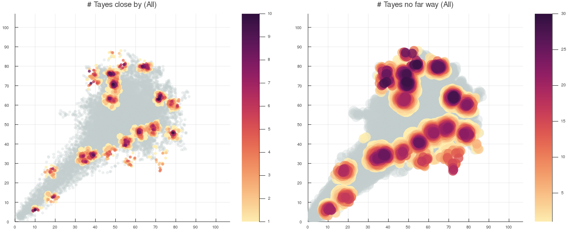
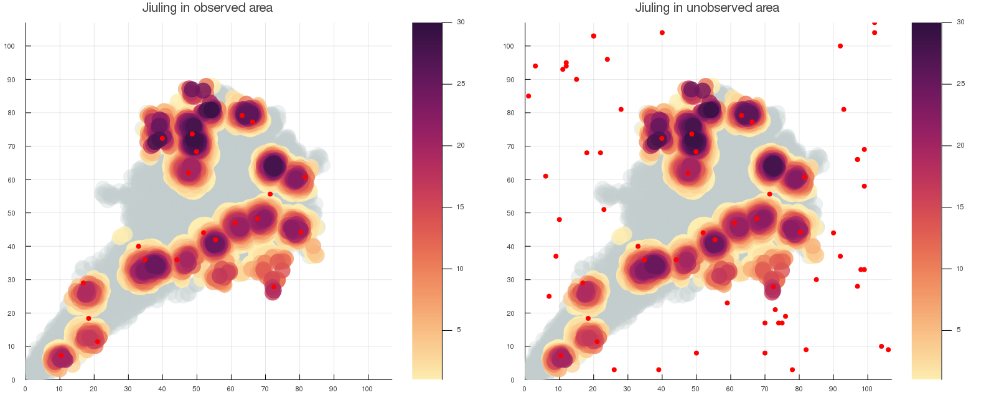

# VE414 Project

## How to run this program?

``` julia
julia main.jl
```

## What’s the output?

1. CSV Files:
   - All CSV output files are in `csv`
   - You can find example output files in `csv.example`
     - `tree_position.csv` is the position of Jiuling on observed area
     - `tree_position_overall.csv` is the position of all Jiulings
2. Plot Files:
   - All png files are in `pic`
   - You can find example output in `pic.example`
     - `fig0.png` is the trip of all of them
     - `fig1.png` is the separate trip
     - `fig7.png` is an simple plot of close and far Tayes
     - `fig5.png` is the beautiful plot of close and far Tayes
     - `fig6.png` gives the position of pridiced Juiling in observed area and unobserved area
3. Terminal print
   - There is **NO** terminal output, you can ignore all the print.

## Where is our code?

- In `src` are the helper files
- `julia pic.jl` plots the figures in `pic`
- `makeGrid.jl` constract the easy-to-read csv files `close_map2.csv` and `close_map_linear.csv`
- `em.jl` is the program to pridict the position of Jiuling accoriding to the observed data
- `poisson.jl` prideicts the unobserved Jiulings


## The `main.jl` code

```julia
include("./julia pic.jl")

include("./em.jl")

include("./makeGrid.jl")

include("poisson.jl")
```


## Image Examples







