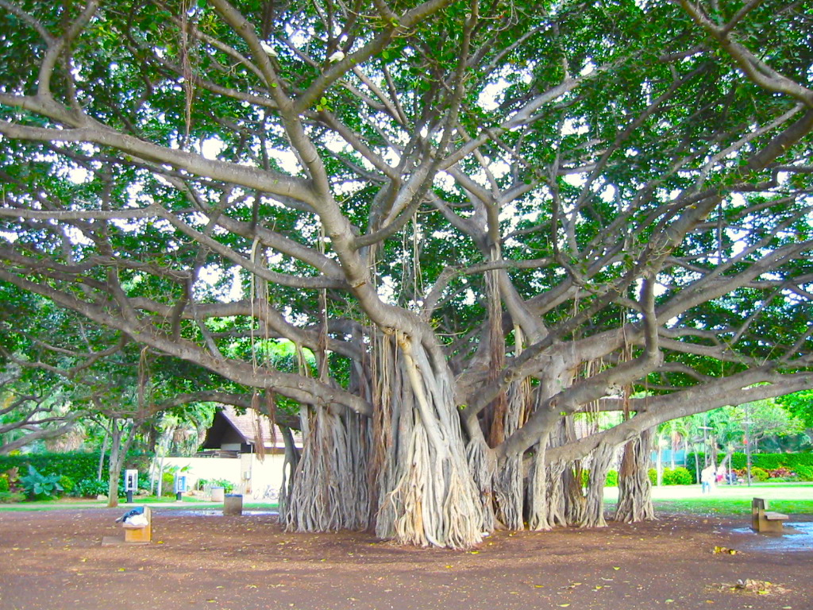

# poisson

## 代码

见`poisson.ipynb`

---

## 一些判断：

一平方米内可否有两棵树？换个说法，两棵树是否可以距离小于$\sqrt2$米？

或者将一片产生很多果子的树看做很多棵树还是看做一颗大树？

假设所有树产生果子数量差不多，则需要看做很多小数，防止可以看做大树。

比如这棵榕树是一棵树，还是很多棵树？

---

## 决策

我们选择将这些树木看作是？？