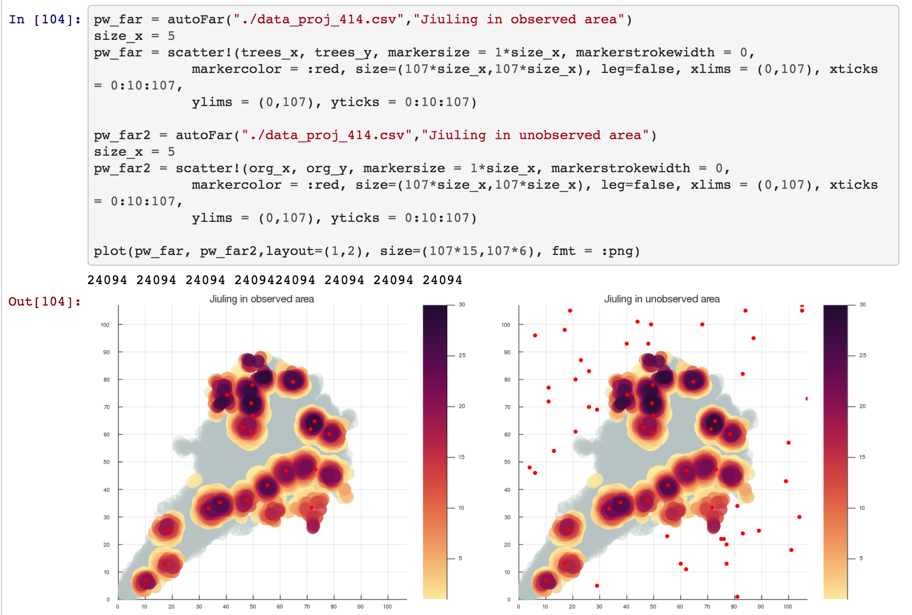

# 绘图接口

## 首先引入库

```julia
using Plots
include("./src/autoPic.jl")
```

## 然后绘图

```julia
pw_far = autoFar("./data_proj_414.csv","Jiuling in observed area")
size_x = 5
pw_far = scatter!(trees_x, trees_y, markersize = 1*size_x, markerstrokewidth = 0,
            markercolor = :red, size=(107*size_x,107*size_x), leg=false, xlims = (0,107), xticks = 0:10:107,
            ylims = (0,107), yticks = 0:10:107)
```

 仅需要修改`trees_x`，`trees_y` 为你需要的两个Array即可。

使用示例在此：[link](https://github.com/Lesliexpy/VE414_Project/blob/%E8%83%A1%E7%82%B3%E5%9F%8E/poisson.ipynb)

